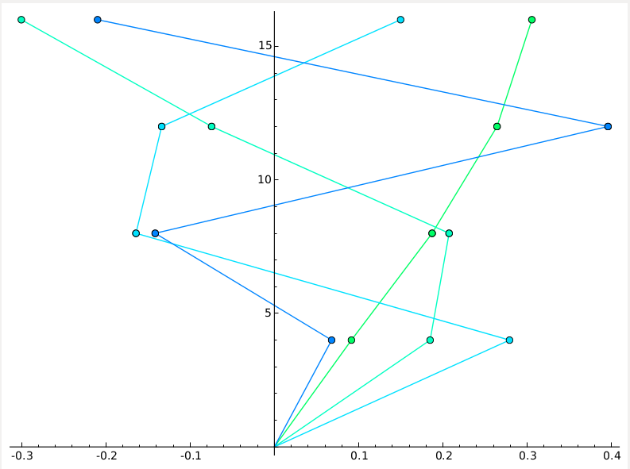

<link rel="stylesheet" href="css/theme/mandeep.css" id="theme">
>###PRESENTATION
>ON
>###DYNAMICS OF STRUCTURE
>##*(DoS)*

----

>##BY-: 
		>###AMARJEET SINGH kAPOOR
		>###1311017

---

>###Introduction to DoS
 
Dynamics of Structures (DoS) is an open-source, free web-based software, developed by students
of (TCC), under the guidance of Dr. H.S. Rai. This software is
used to compute the Modes of vibration in which the structure can move and also force applied
on each floor due to the vibration caused by the earthquake. So, that Civil engineers can analysis
the stability of structure consisting of many stories.

----

>###*Basic concept of what it do

Structural analysis is mainly concerned with finding out the behavior of a physical structure when subjected to force. This action can be in the form of load due to the weight of things or some other kind of excitation such as an earthquake, shaking of the ground due to a blast nearby, etc

----

>###modes

A modal analysis calculates the frequency modes or natural frequencies of a given system. The natural frequency of a system is dependent only on the stiffness of the structure and the mass which participates with the structure (including self-weight).

---

---

>###Requirements

1. Provide on-line way to analysis so that individual does not have to install anything.
2. Send PDF to the user in the form of email.
3. Make it work like batch mode. so, that user can give inputs together and relax.
4. Accept inputs from the user in *.csv file format
5. Help M.Tech and Civil Engineer to analysis structure.
6. Automatic calculation of modal force and modes.
7. Reduce the time for analysis.
8. Generates the final output in the form of pdf

---

>###TECHNOLOGY USED -:
1. Sagemath
2. Django
3. LaTeX
4. Doxygen
5. Git

----

>###SageMath 

SageMath(previously Sage or SAGE, System for Algebra and Geometry Experimentation) is
mathematical software with features covering many aspects of mathematics, including algebra,
combinatorics, numerical mathematics, number theory, and calculus.

----

>###Django 

Django is an open source web application framework written in python. It lets you build high-
performing, elegant Web applications quickly. Django focuses on automating as much as possible.
Django adopts the standard MVC (Model-View-Controller) design pattern. But instead, their
naming convention is the MTV (Model-Template-View)

----

>###LaTeX 

LaTeX, I had never heard about this term before doing this project, but when I came to know about
it’s features, found it excellent. LaTeX is a document
markup language and document preparation system for the TEX typesetting program

----

>###Doxygen 

Doxygen is a documentation generator, a tool for writing software reference documentation. The
documentation is written within code, and is thus relatively easy to keep up to date. Doxygen can
cross reference documentation and code, so that the reader of a document can easily refer to the
actual code.

----

>###Git 

Git is a distributed revision control and source code management (SCM) system with an emphases on speed, data integrity, and support for distributed, non-linear work flows.

---
 
 
>###Implementation

Development of DoS started with development in phases which focus on particular need of project.
Various phases and their detail are given below -:

----

• Phase I (Sagemath) -:
During Phase I, we wrote code in Sagemath to compute all the required output variable.
We used two files for this.Input variable are written in input.sage and main.sage loads this
variable and compute all desired inputs.

----

• Phase II (LaTeX) -:
During phase II, we embedded sage modules into LaTeX by loading them into civil.tex and
then displayed these variables in output PDF and all this work is done by sagetex.sty. To
execute all this commands on one go we wrote script civil.sh.

----

• Phase III (Django) -:
During phase III, we provided web interface to this software using Django. Djanog was used
to get input from user and write input.sage file for particular user then civil.sh is called by
passing name of user directory to it and then get output PDF.

----

• Phase IV (Improvise) -:
During phase IV, we improved the code structure and added additional functionality like
sending PDF as email and accepting input as CSV file. Finally, the UI was improved and
made responsive.

----

• Phase V (Testing) -:
During phase V, we tested the software for various conditions and then applied required
error control and messaging mechanism. initialfile.py file was created to save software from
problem of server restart which can causes processing user request to stop. so, that the
interrupted request of user can be restart and send PDF.

----

• Phase VI (Documentation) -:
During final phase, we documented the project( developers documentation and README.md)
using doxygen and wrote the report for this software. 

---

# THE END .

