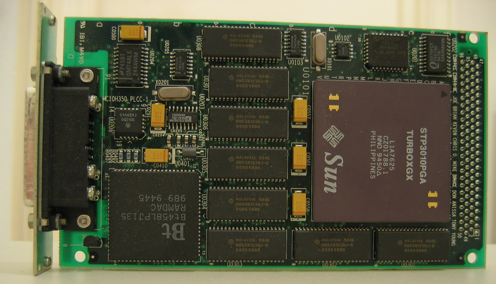

<link rel="stylesheet" href="css/theme/mandeep.css" id="theme">
>###Presentation 
>on
>##*Video Memory Frame Buffer & Video Ram*

----

>##Cast and crew -: 
		>###amarjeet(1311017)

---

>###Video Memory(Frame Buffer)*

A Frame buffer is a portion of RAM containing a bitmap that is driven to a video display from a memory buffer containing a complete frame of data.
The information in the memory buffer typically consists of color values for every pixel on the screen. Color values are commonly stored in 1-bit binary, 4-bit, 8-bit, 16-bit high color and 24-bit true color formats

---

----

1. As the demand for better graphics increased, hardware manufacturers created a way to decrease the amount of CPU time required to fill the frame buffer. This is commonly called "graphics accelerating".
2. It began to make more sense to put the memory on the video card itself
3. Some motherboard designs also integrate the video chipset into the motherboard itself and then use part of the system RAM for the frame buffer. This is called unified memory architecture.

----

---

>##Video Ram

Video RAM (VRAM) means all forms of random access memory (RAM) used to store image data for a computer display
Video RAM is a buffer between the computer processor and the display often called the frame buffer.

----

>###Working of VRAM

- When images are to be sent to the display, they are first read by the processor as data from some form of main (non-video) RAM and then written to video RAM
- From video RAM (the frame buffer), the data is converted by a RAM digital-to-analog converter (RAMDAC) into analog signals that are sent to the display presentation mechanism such as a cathode ray tube (CRT).

----

>###Working of VRAM

- Video RAM comes in a 1 or 2 megabyte package and is located on the video adapter card in the computer. 
- Video RAM is dual-ported, which means that while the processor is writing a new image to video RAM, the display is reading from video RAM to refresh its current display content. The dual-port design is the main difference between main RAM and video RAM

---

>#Types of VRAM

----

>###Synchronous Graphics RAM (SGRAM):

SGRAM is an inexpensive type of RAM that is clock-synchronized. This means data can be modified in a single operation rather than as a sequence of read, write, and update operations.

----

>###Rambus Dynamic RAM (RDRAM):

RDRAM includes a proprietary Rambus bus that speeds up the data flow between video RAM and the frame buffer. It's optimized for video streaming.  

----

>###Window RAM (WRAM):

This high-performance VRAM is dual-ported, has about 25% more bandwidth than standard VRAM, and costs less. 

----

>###Multibank Dynamic RAM (MDRAM):

MDRAM is also high-performance VRAM, which divides the memory into divisions of 32 KB that can be accessed individually. This makes memory transfers more efficient and increases overall performance. It can be manufactured with just the right amount of memory for a given resolution, so it is cheaper to manufacture than most other types of VRAM.

---

# THE END .

